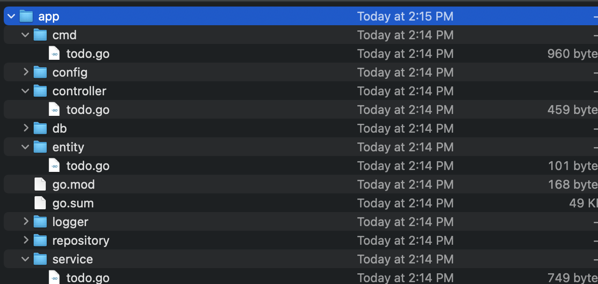

# go-web-cli

## Build: ##
``` 
go build -o web-cli  main.go   
```

## Usage: ##
```
./web-cli --pkgname github.com/srikanthbhandary/cli   
```


## Folder strcture ##



## Run ##

```
cd app
go run cmd/todo.go 
```

Now open the browser and launch the url  http://127.0.0.1:8080/todos
